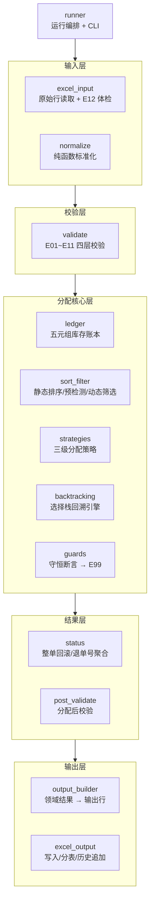

# 退货入库分配系统 · Python 版

> Excel VBA 退货入库分配系统的 **Python 忠实镜像移植**：模块边界与 VBA 版 M01~M15 一一对应，
> 行为逐字段对齐《退货入库分配系统_需求与技术方案.md》，并通过**双实现差分测试（对拍）**验证一致性。

## 项目亮点

- **完整业务闭环**：Excel 进 / Excel 出，覆盖数据标准化 → 四层校验（E01~E12）→ 三级分配策略 → 选择栈回溯 → 整单回滚 → 状态聚合 → 五张输出表（含可观测性的运行历史与调试日志）
- **非平凡算法核心**：贪心三级策略 + 动态 nextMinQty 筛选 + 预检测 A/B + 有预算上限的回溯搜索，含库存守恒工程守卫（断言失败即抛 E99）
- **双实现对拍**：同一输入经 VBA 版（COM 无头驱动）与 Python 版各跑一遍，五张输出表逐单元格 diff——6 个场景 5 个零差异，唯一分歧实证为 VBA 侧预检测 B 漏检缺陷（详见 `对拍报告.md`）
- **测试体系**：305 个 pytest 用例（单元 / 模块集成 / E2E 验收 T1~T11+ / 真实文件往返 / CLI），对应 VBA 版 44 个 TC 文档

## 架构



每个 Python 模块与 VBA 模块一一对应（`models.py`↔M01 modTypes … `runner.py`↔M15 modRunner），
模块级 docstring 注明对应的 VBA 文件与需求章节，可对照阅读。

## 运行方式

```bash
# 环境准备（首次；仓库内置便携 Python 于 .runtime/，也可用系统 Python 3.11+）
python -m venv .venv
.venv/Scripts/pip install -e ".[dev]"

# 测试（305 个用例）
.venv/Scripts/python -m pytest

# 仅运行校验（Dry Run：只跑 E01~E11 校验，输出汇总表与异常明细表）
.venv/Scripts/python -m returned_inventory validate <工作簿.xlsx>

# 完整分配（Full Run：校验 → 分配 → 后校验 → 五张输出表写回工作簿）
.venv/Scripts/python -m returned_inventory allocate <工作簿.xlsx>
```

CLI 退出码：`0` 成功 / `1` 其他错误 / `2` 配置错误 / `3` E12 结构异常 / `4` E99 运行时异常。

## 对拍验证（差分测试）

```bash
# 1. 构造 6 个对拍场景的输入（TC21/TC24/TC20/TC19/TC36 + 自编预检测B场景）
.venv/Scripts/python diff_build_inputs.py

# 2. VBA 侧无头运行（Excel COM，自动备份与清理）
powershell -ExecutionPolicy Bypass -File diff_run_vba.ps1

# 3. 五张输出表逐单元格 diff（退出码 0 = 无异常分歧，可作回归门禁）
.venv/Scripts/python diff_check.py
```

结论与分歧分析见 `对拍报告.md`；中间产物在 `data/diff/`。

## 目录说明

```
python_port/
├── src/returned_inventory/   # 15 个模块，对应 VBA M01~M15
├── tests/                    # 305 个 pytest 用例（含 E2E 验收与文件集成）
├── data/                     # 对拍资产（E2E 工作簿 + diff 中间产物）
├── diff_build_inputs.py      # 对拍：输入构造
├── diff_run_vba.ps1          # 对拍：VBA 侧无头运行
├── diff_check.py             # 对拍：逐字段 diff
└── 对拍报告.md               # 对拍结论
```
